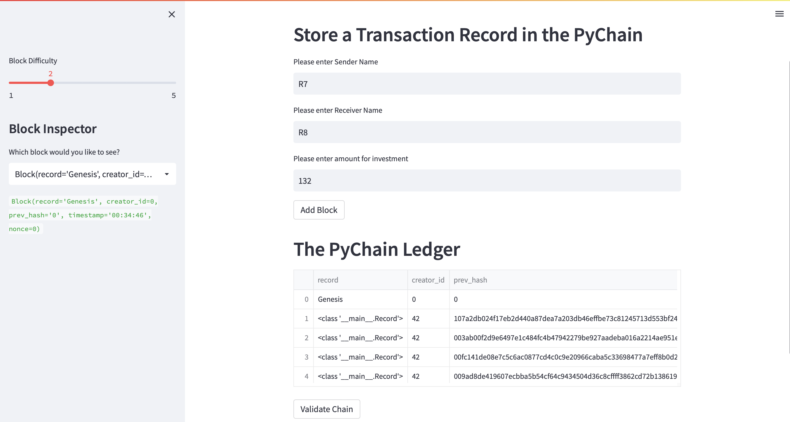

# Pychain Ledger
## Webpage interface for blockchain
Build a blockchain-based ledger system, complete with a user-friendly web interface. This ledger should allow partner banks to conduct financial transactions (that is, to transfer money between senders and receivers) and to verify the integrity of the data in the ledger.

Terminal Activation

Blocks Validation

